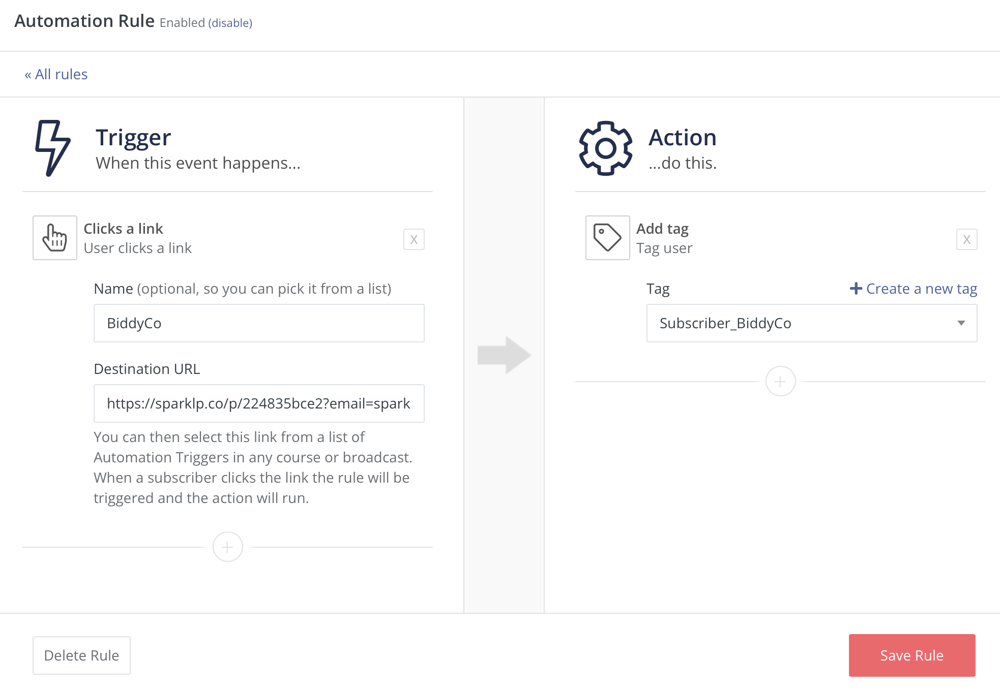
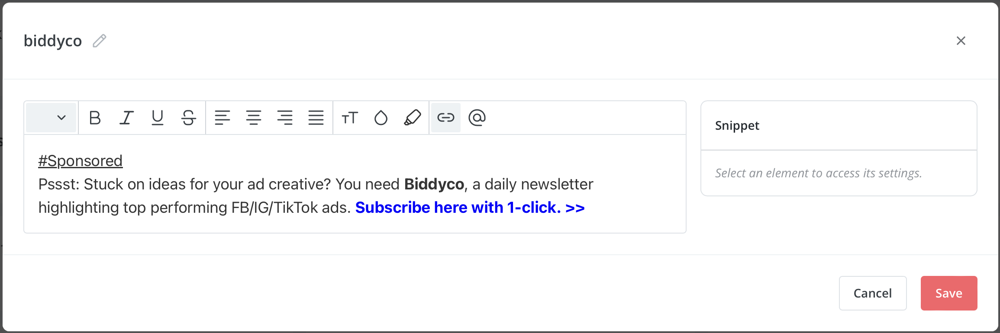

# SparkLoop Magic Link Monetization Script

[SparkLoop](https://dash.sparkloop.app/signup?aff=e3f393b8) [^1] is a paid newsletter recommendation network that pays you to recommend other quality newsletters to your subscribers.

I built this script to help me maximize each recommendation impression automatically. The script rotates recommendations in your newsletter and keeps track of which ones your subscriber has joined so that they are not shown recommendations they have already subscribed to.

There's a quick one-time setup process needed to get running, but after that, the script mostly takes care of the rest.

## Installation

To get started, you'll need to set up tags for each newsletter you plan to recommend. Users who click the [SparkLoop Magic Links ](https://dash.sparkloop.app/signup?aff=e3f393b8) [^1] will automatically be tagged with the corresponding newsletter they clicked on. We can safely assume the user is subscribed because Magic Links automatically does a 1-click subscribe to recommendations.

In our example code, we'll be recommending Biddyco, Creator Wizard, Why We Buy, and Stacked Marketer.

```

```
The tagging format I use is `Subscriber_NewsletterName`; you are free to use what works for you.

### Create Link Triggers
Next, you will need to create a link trigger for each of your [SparkLoop Magic Links ](https://dash.sparkloop.app/signup?aff=e3f393b8) [^1]. The link trigger adds the appropriate tag to each subscriber when they click the Magic Link. In the image below, the subscriber will be tagged with `Subscriber_BiddyCo` when they click the Biddyco Magic link. The Monetization script uses this tag to know which links to remove from the recommendations.



### Create Ad Snippets
It's optional, but I like to implement each newsletter ad as a [ConvertKit Snippet](https://convertkit.com/?lmref=lfsx1g) [^1]. This allows for easy updating of the code in one spot and have it updated everywhere it's used.



### Customize The Monetization Script
Now that you have everything set up in [ConvertKit](https://convertkit.com/?lmref=lfsx1g) [^1], you can customize the rest of the code

```

      
        {{ snippet.biddyco }}
      
        {{ snippet.stacked-marketer }}
      
        {{ snippet.shopifreaks }}
      
        {{ snippet.creator-wizard }}
      
        {{ snippet.why-we-buy }}

```
We'll need a `when` statement for each newsletter you are recommending via this method.

`` is the name of the tag you set up for each newsletter and `{{ snippet.biddyco }}` is the code to display the contents of the snippet you set up. If you choose not to use snippets, you can simply paste in the ad/recommendation you want to display.

The final modification to make is to define what to show as a default placeholder for situations where a subscriber ends up subscribing to all recommendations. I've implemented this as a snippet as well, but as with the other options, you can just paste in content into this spot too.

```

  
  {{ snippet.alternate-content }}

```

The only line to change is `{{ snippet.alternate-content }}`; however, if you choose to use the same snippet name as mine, you can leave this unchanged.

### Final Setup

You could copy and paste this code into your email templates as is; however, I like to also set up all this code as a snippet as well. It gives you the benefit of an easy spot to update the recommendations block in one spot.


Depending on how you name your snippet, adding the recommendation block into your template is as simple as adding the following to your template:

`{{ snippet.sparkloop }}`

[^1]: Links to ConvertKit and SparkLoop contain affiliate links
